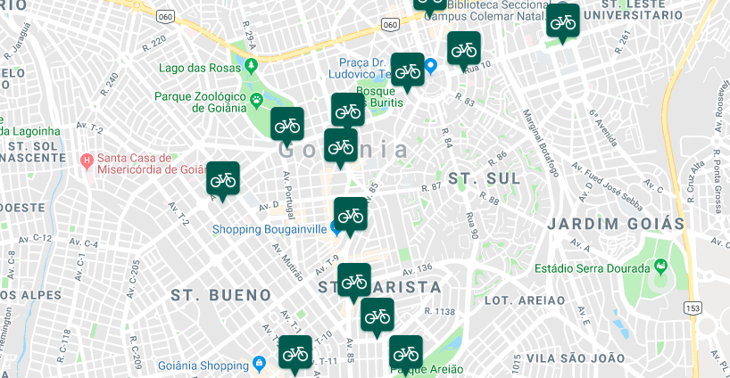

# Scrapy Crawler to Borrowed Bicycles

### Project

Crawler to collect a information about Shared-Bike in São Paulo and Goiânia

* https://bikesampa.tembici.com.br/bikesampa/mapaestacao.asp
* https://www.mobilicidade.com.br/bikegoiania/mapaestacao.aspx

### Context

In many cities in Brazil it is easy to borrow a bicycle at stations throughout the city. Each station contains a limited number of bicycle and everyone can deposit or withdraw a bike.

This dataset inclide a state of station, with number of availables bikes and information about the station every 5 minutes for about a month and a half.

### Content

Contains two sets of data, one about stations of São Paulo and the another about Goiânia. Two cities in Brazil.
Columns:

* **address**: Address of station
* **lat**: Latitude of station
* **lng**: Longitude of station
* **name**: Name of Station
* **available**: Total available bikes to borrow (Bikes in the station)
* **free**: Total free space to deposit a bike
* **status**: Status of station
* **created_at**: Date/Time from data collect

### Kaggle Data

https://www.kaggle.com/marlesson/bicycle-sharing-brazil-sp-gyn
